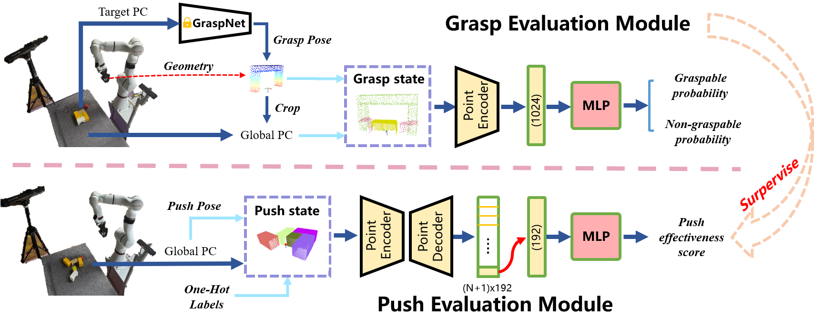

# GAPG: Geometry Aware Push-Grasping Synergy for Goal-Oriented Manipulation in Clutter

This is the official repository for the paper:

**GAPG**: **G**eometry **A**ware **P**ush-**G**rasping Synergy for Goal-Oriented Manipulation in Clutter, **Accepted by ICRA 2026**.

- Paper: [arXiv:2603.21195](https://arxiv.org/abs/2603.21195)

---

## Overview

We propose a **geometry-aware push-grasp synergy framework** that leverages point cloud data to integrate grasp and push evaluation. Specifically, the grasp evaluation module analyzes the geometric relationship between the gripper point cloud and the points enclosed within its closing region to determine grasp feasibility and stability. Guided by this evaluation, the push evaluation module predicts how pushing actions influence future graspable space, enabling the robot to select actions that reliably transform non-graspable states into graspable ones. By jointly reasoning about geometry in both grasping and pushing, our framework achieves safer, more efficient, and more reliable manipulation in cluttered environments.


---

## Setup

### Tested Environment

The code has been tested under the following environment:

| Component | Version |
| --- | --- |
| OS | Ubuntu 20.04 |
| Python | 3.8 |
| PyBullet | 3.2.7 |
| CUDA | 11.8 |
| GPU | NVIDIA GTX 4060Ti, 8 GB memory |

---

## Installation

### 1. Clone the Repository

```bash
git clone https://github.com/xiaolijz/GAPG.git
cd GAPG
```

### 2. Create Conda Environment

```bash
conda create -n gapg python=3.8
conda activate gapg
```

### 3. Install Python Dependencies

```bash
pip install torch==2.4.1+cu118 torchvision==0.19.1+cu118 torchaudio==2.4.1+cu118 --index-url https://download.pytorch.org/whl/cu118
pip install -r requirements.txt
```
### Note
requirements.txt contains graspnetAPI, please modify it to your local path, for example:

```txt
graspnetAPI @ file:///home/your_user/your_project_path/models/graspnetAPI
```

### 4. Install PointNet2

```bash
cd models/graspnet/pointnet2
python setup.py install
cd ../../..
```

### 5. Install KNN Module

```bash
cd models/graspnet/knn
python setup.py install
cd ../../..
```
### 6. Install Pytorch3D

```bash
conda install https://anaconda.org/pytorch3d/pytorch3d/0.7.8/download/linux-64/pytorch3d-0.7.8-py38_cu118_pyt241.tar.bz2

```

---

## Data Collection

### 1. Collect Grasp Data

To collect grasp data for training the grasp module, run:

```bash
python collect_grasp_data.py
```
GraspNet pre-trained models can be downloaded from: [Google Drive](https://drive.google.com/file/d/1hd0G8LN6tRpi4742XOTEisbTXNZ-1jmk/view)
(put the downloaded file in the `models/graspnet/checkpoints` directory)
### 2. Collect Push Data

To collect push data for training the push module, run:

```bash
python collect_push_data.py
```

---

## Training

### 1. Train the Grasp Module

```bash
python train_grasp.py
```

### 2. Train the Push Module

```bash
python train_push.py
```

---

## Pre-trained Models

If you do not want to train the models from scratch, we provide pre-trained models.

Download link:

[Google Drive](https://drive.google.com/drive/folders/1UAgLYQEvscLsoyXO37xN8M3frhLiBtHa)

After downloading, please place the model files in the corresponding checkpoint directory according to your project structure.

---

## Evaluation

To evaluate the trained or pre-trained model, run:

```bash
python grasp_push_eval.py
```

---

## Citation

If you find this work useful in your research, please consider citing our paper:

```bibtex
@article{xiao2026gapg,
  title={GAPG: Geometry Aware Push-Grasping Synergy for Goal-Oriented Manipulation in Clutter},
  author={Xiao, Lijingze and Du, Jinhong and Cong, Yang and Diao, Supeng and Ren, Yu},
  journal={arXiv preprint arXiv:2603.21195},
  year={2026}
}
```

---

## Acknowledgments

Some code in this repository is borrowed from open-source projects, including [**GarmentPile**](https://github.com/AlwaySleepy/Garment-Pile), [**Vision-Language-Grasping**](https://github.com/xukechun/Vision-Language-Grasping) and [**GraspNet Baseline**](https://github.com/graspnet/graspnet-baseline). We sincerely appreciate their valuable contributions to the community.

---

